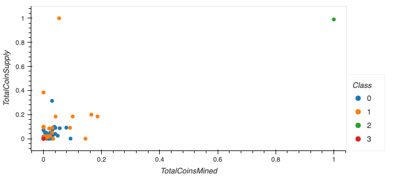

# Cryptocurrencies
Module 18 - Unsupervised Machine Learning

## Overview of the Analysis
The purpose of this analysis is to use unsupervised machine learning to conduct an exploratory  analysis to classify tradable cryptocurrencies for a prominent investment bank.

The analysis involves preprocessing the data, using PCA to reduce dimensions, clustering with the K-Means algorithm and creating visualizations with hvplot.

## Results

After conducting the analysis, we have classified 532 tradable cryptocurrencies into 3 principal components which resulted in 4 classes.

</img>